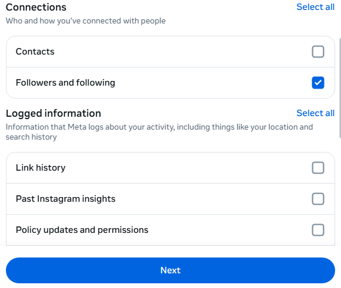
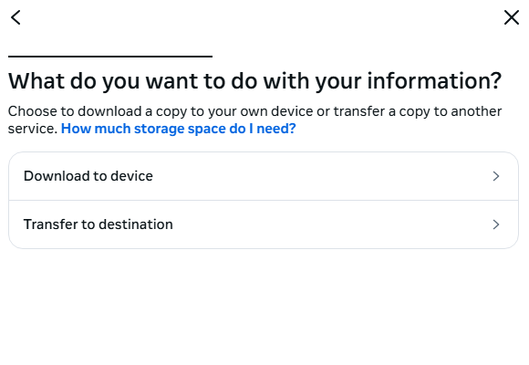

# FindFakeFriends

**FindFakeFriends** is a privacy-friendly web app that helps you discover:
- Who you follow on Instagram that doesn't follow you back ("fake friends")
- Who follows you but you don't follow back
- Your true mutuals

All analysis is done **entirely in your browser**, your data never leaves your device.

---

## 🚀 [Try It Yourself](https://aksharp5.github.io/FindFakeFriends/)

---

## 📥 How to Download Your Instagram Data

To use this tool, you need to download your Instagram data in a specific way. Follow these steps in the Instagram app:

1. **Go to your profile, open the menu, then access "Your Activity".**  
   
2. **Tap on "Download Your Information", and click on the "Continue" button.**  
   
3. **Click on "Download or transfer information".**  
   
4. **Select "Some of your information".**  
   
5. **Scroll to "Connections" and select only "Followers and Following". Click "Next".**  
   
6. **Select "Download to device" and press "Next".**  
   
7. **Set "Date range" to "All time" and "Format" to "HTML". Press "Create files".**  
   

Once your download is ready, upload the resulting ZIP file to this site to analyze your followers and following lists.

---

## ✨ Features
- Modern, responsive UI
- Drag-and-drop or click-to-upload ZIP file
- Tabs for Fake Friends, Not Your Friends, and True Friends
- Remove users from lists interactively
- Works entirely client-side (no data leaves your device)

---

## 🛠️ Technologies Used
- HTML, CSS, and JavaScript
- [JSZip](https://stuk.github.io/jszip/) for ZIP file parsing

---

## 📝 How It Works
1. **Upload your Instagram ZIP file** (exported as described above).
2. The app extracts your followers and following lists from the HTML files inside the ZIP.
3. It compares the lists and categorizes users into:
   - **Fake Friends:** You follow them, but they don't follow you back
   - **Not Your Friends:** They follow you, but you don't follow them back
   - **True Friends:** Mutual followers
4. You can interactively remove users from any list for your own tracking.

---

## 📧 Contact
For questions, suggestions, or contributions, feel free to open an issue or reach out via email: **aksharcommit@gmail.com**

